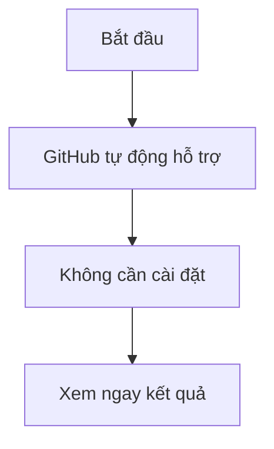

# Test Mermaid trên GitHub
## Biểu đồ đầu tiên của tôi


```mermaid
graph TD
A[Bước 1] --> B[Bước 2]
B --> C[Bước 3]
```mermaid
graph TD
A[Hình chữ nhật]
B(Hình bo góc)
C([Hình stadium])
D[[Hình đặc biệt]]
E[(Database)]
F((Hình tròn))
G{Hình thoi}
H{{Hình lục giác}}

I[/Hình thang/]
J[\Hình thang ngược\]
```
I[/Hình thang/]
J[\Hình thang ngược\]
```
